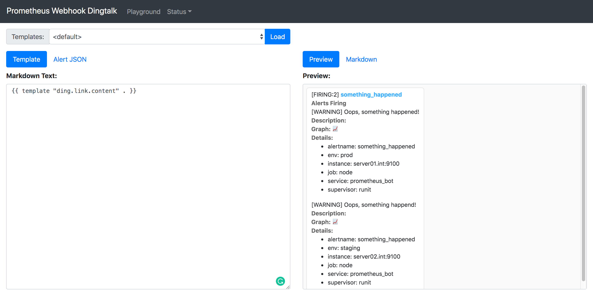

## 常见问题

### 如何编写模板

模板语法是 golang 的 [text/template](https://golang.org/pkg/text/template/), 需要一定的学习来掌握。
可以使用 [sprig](http://masterminds.github.io/sprig/) 提供的各种工具简化模板编写。

最后，在程序启动时指定 `--web.enable-ui ` 参数, 启动后访问 `http://localhost:8060/ui` 进行验证，如图所示:



### GeneratorURL 不对 / 模板中链接的问题

相关 Issue:

- https://github.com/timonwong/prometheus-webhook-dingtalk/issues/27
- https://github.com/timonwong/prometheus-webhook-dingtalk/issues/20

请配置 prometheus 的 `--web.external-url`:

```
      --web.external-url=<URL>   The URL under which Prometheus is externally reachable (for example, if Prometheus is served via a reverse proxy). Used for generating relative and absolute links
                                 back to Prometheus itself. If the URL has a path portion, it will be used to prefix all HTTP endpoints served by Prometheus. If omitted, relevant URL components
                                 will be derived automatically.
```

### 如何恢复为老版的样式 (v1.0.0 之前)

一、准备好默认的文件, 参见 `contrib/templates/legacy/default.tmpl`

二、编辑配置文件, 修改 `templates` 一节, 如下所示

```yaml
templates:
  # Docker 的话可以直接这样写
  - /etc/prometheus-webhook-dingtalk/templates/legacy/template.tmpl
```

### 能不能不重启就重新加载配置文件

可以，两个方法:
1. 发送 SIGHUP 信号量: `kill -HUP <pid>`
2. 启动的时候加入 `--web.enable-lifecycle` 参数，然后通过 `HTTP PUT` 或 `HTTP POST` 方法访问 `/-/reload` 即可，例:
   ```bash
   curl -XPOST http://localhost:8060/-/reload
   ```
